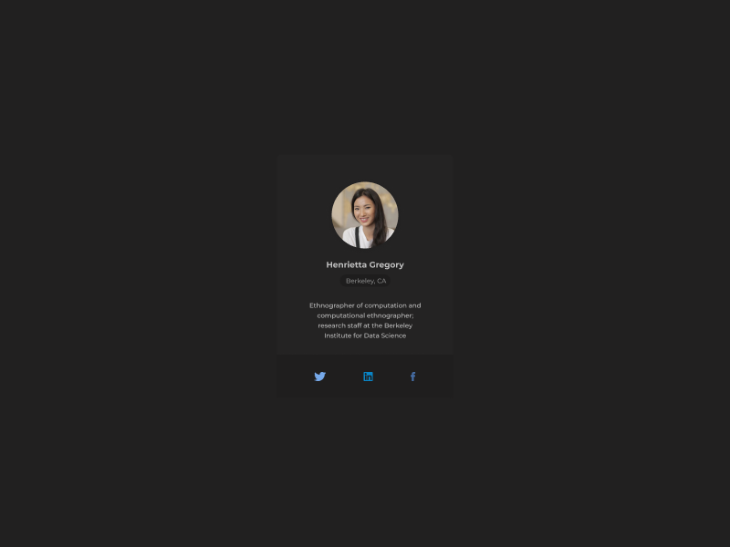

# Profile Card



Nuestro primer desafío será codificar una **tarjeta de presentación**, usando HTML y CSS, y lograr que se parezca lo más posible al diseño.

## Recursos

Aquí encontrarás los recursos necesarios para completar el desafío.

```css
## Diseño
- Móvil: 375px
- Escritorio: 1200px

## Colores
- Background: #212020
- Card: #242323
- Paragraph: #C2C2C2
- Footer: #1F1E1E

## Tipografía
- Font size (paragraph) - 14px
- Family: [Montserrat](https://fonts.google.com/specimen/Montserrat)
```

## Ideas

Eres libre de utilizar las tecnologías que quieras. Lo importante es practicar y completar un proyecto todos los días:

- [Git](https://git-scm.com/)
- [CSS](https://www.w3schools.com/css/default.asp)
- [HTML](https://www.w3schools.com/html/default.asp)
- [Bootstrap](https://getbootstrap.com/)

## Comunidad

Únete a cientos de miembros que están mejorando sus habilidades de codificación y hablando sobre el desafío **100 days of projects**.

[Quiero unirme](https://chat.whatsapp.com/LDaK0dksr8f7FbsTWSf0ww)

## Referencias

- Diseño tomado de: [UI Design Daily](https://www.uidesigndaily.com/posts/sketch-profile-card-user-day-718)

---
> 🏷️_La mejor manera de aprender a programar es practicando todos los días._