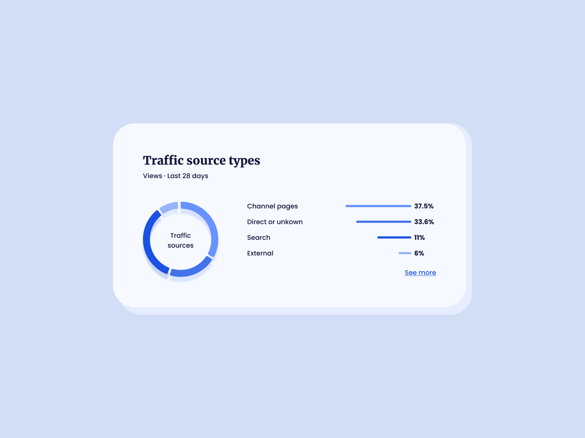

# Analytics Statistics



Nuestro cuarto desafío será codificar una **tarjeta de análisis estadístico**, usando HTML y CSS, y lograr que se parezca lo más posible al diseño original.

## Recursos

Aquí encontrarás los recursos necesarios para completar el desafío.

```css
## Diseño
- Móvil: 375px
- Escritorio: 1200px


## Colores
- Background: #D2DDF6
- Card: #F6F9FF
- Paragraph: #12163C


### Gráfico
- #1A52E1
- #4473EA
- #6792FF
- #96B3FF


## Tipografía
- Font size (paragraph) - 16px
- Family (title): [Merriweather](https://fonts.google.com/specimen/Merriweather)
- Family (body): [Poppins](https://fonts.google.com/specimen/Poppins)
```

## Ideas

Eres libre de utilizar las tecnologías que quieras. Lo importante es practicar y completar un proyecto todos los días:

- [Git](https://git-scm.com/)
- [CSS](https://www.w3schools.com/css/default.asp)
- [HTML](https://www.w3schools.com/html/default.asp)
- [Bootstrap](https://getbootstrap.com/)

## Comunidad

Únete a cientos de miembros que están mejorando sus habilidades de codificación y hablando sobre el desafío **100 days of projects**.

<a href="https://chat.whatsapp.com/LDaK0dksr8f7FbsTWSf0ww" class="btn">
  Quiero unirme
</a>


## Referencias

- Diseño tomado de: [UI Design Daily](https://www.uidesigndaily.com/posts/figma-analytics-statistics-day-1567)

---

> 🏷️"_La mejor manera de aprender a programar es practicando todos los días."_  

---