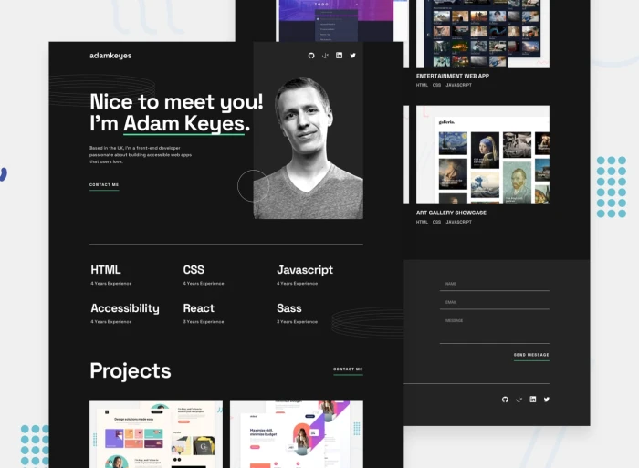

# Single-Page Developer Portfolio🎉



Felicidades por llegar hasta aquí. Sabemos que no ha sido fácil el camino, pero has logrado vencer todos los obstáculos. Nuestro desafío final será codificar un **portafolio frontend**, usando HTML, CSS y JavaScript, y lograr que se parezca lo más posible al diseño original.


## Recursos

Aquí encontrarás los recursos necesarios para completar el desafío.

```css
## Diseño
- Móvil: 375px
- Escritorio: 1440px


🎉Si llegaste hasta aquí, envíame un correo para los recursos de este reto final.🎉
```


## Comunidad

Únete a cientos de miembros que están mejorando sus habilidades de codificación y hablando sobre el desafío **100 days of projects**.

<a href="https://chat.whatsapp.com/LDaK0dksr8f7FbsTWSf0ww" class="btn">
  Quiero unirme
</a>


## Referencias

- Diseño tomado de: [Frontend Mentor](https://www.frontendmentor.io/challenges/singlepage-developer-portfolio-bBVj2ZPi-x)

---

> 🏷️"_La mejor manera de aprender a programar es practicando todos los días."_  

---