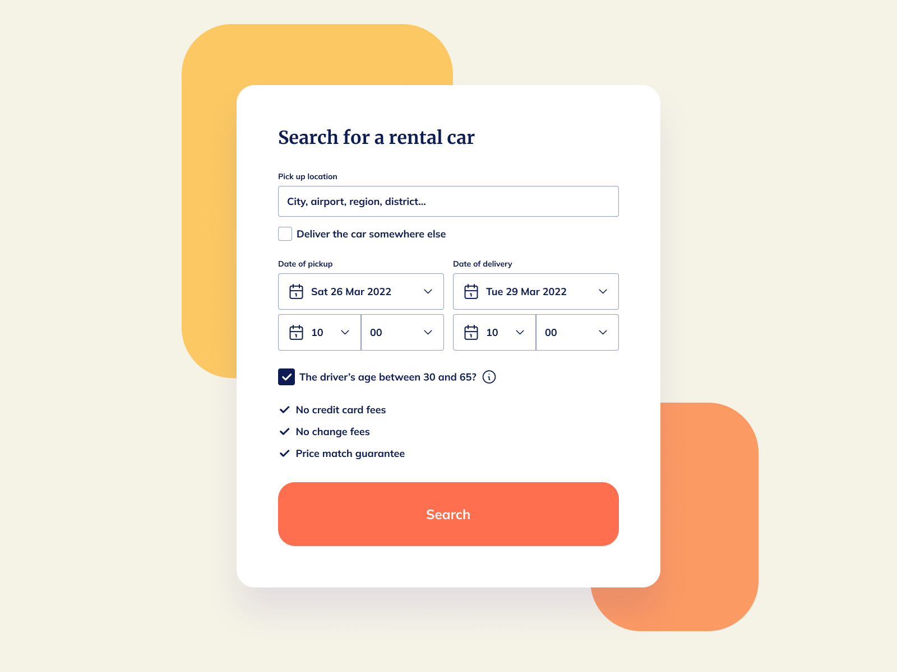

# Rent A Car 



Nuestro desafío será codificar un componente de **búsqueda renta de autos**, usando HTML y CSS, y lograr que se parezca lo más posible al diseño original.

## Recursos

Aquí encontrarás los recursos necesarios para completar el desafío.

```css
## Diseño
- Móvil: 375px
- Escritorio: 1200px


## Colores
- Body: #F5F3E6
- Card: #FFFFFF
- Top shape card: #FCC863
- Bottom shape card: #FC9A63
- Input border: #8F9DCE
- Button: #FE6F4F
- Text: #0D1C52

## Tipografía
### Body
- Font size: 16px


### Fonts
- Family (title): [Merriweather](https://fonts.google.com/specimen/Merriweather)
- Family (body): [Mulish](https://fonts.google.com/specimen/Mulish)
```

## Ideas

Eres libre de utilizar las tecnologías que quieras. Lo importante es practicar y completar un proyecto todos los días:

- [Git](https://git-scm.com/)
- [CSS](https://www.w3schools.com/css/default.asp)
- [HTML](https://www.w3schools.com/html/default.asp)
- [Bootstrap](https://getbootstrap.com/)

## Comunidad

Únete a cientos de miembros que están mejorando sus habilidades de codificación y hablando sobre el desafío **100 days of projects**.

<a href="https://chat.whatsapp.com/LDaK0dksr8f7FbsTWSf0ww" class="btn">
  Quiero unirme
</a>


## Referencias

- Diseño tomado de: [UI Design Daily](https://www.uidesigndaily.com/posts/figma-rent-a-car-ui-design-card-search-day-1579)

---

> 🏷️"_La mejor manera de aprender a programar es practicando todos los días."_  

---