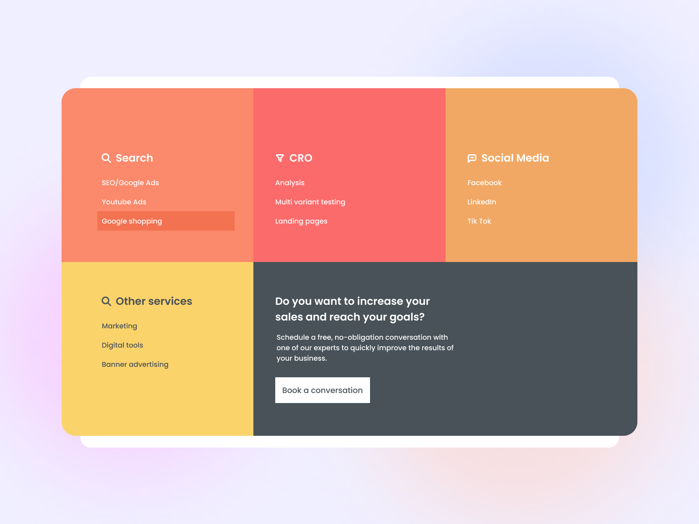

# Footer



Nuestro desafío será codificar un **pie de página**, usando HTML y CSS, y lograr que se parezca lo más posible al diseño original.

## Recursos

Aquí encontrarás los recursos necesarios para completar el desafío.

```css
## Diseño
- Móvil: 375px
- Escritorio: 1200px


## Colores
- Body: #F0EFFF
- Card shadow: #FFFFFF
- Card 1: #FB896B
- Card 1 row: #F27251
- Card 2: #FB6B6B
- Card 3: #F1A864
- Card 4: #FBD36B
- Card 4 text: #485258
- Card 5: #485258


## Tipografía
### Body
- Font size: 16px

### Font
- Family: [Poppins](https://fonts.google.com/specimen/Poppins)
```

## Ideas

Eres libre de utilizar las tecnologías que quieras. Lo importante es practicar y completar un proyecto todos los días:

- [Git](https://git-scm.com/)
- [CSS](https://www.w3schools.com/css/default.asp)
- [HTML](https://www.w3schools.com/html/default.asp)
- [Bootstrap](https://getbootstrap.com/)

## Comunidad

Únete a cientos de miembros que están mejorando sus habilidades de codificación y hablando sobre el desafío **100 days of projects**.

<a href="https://chat.whatsapp.com/LDaK0dksr8f7FbsTWSf0ww" class="btn">
  Quiero unirme
</a>


## Referencias

- Diseño tomado de: [UI Design Daily](https://www.uidesigndaily.com/posts/figma-footer-day-1530)

---

> 🏷️"_La mejor manera de aprender a programar es practicando todos los días."_  

---