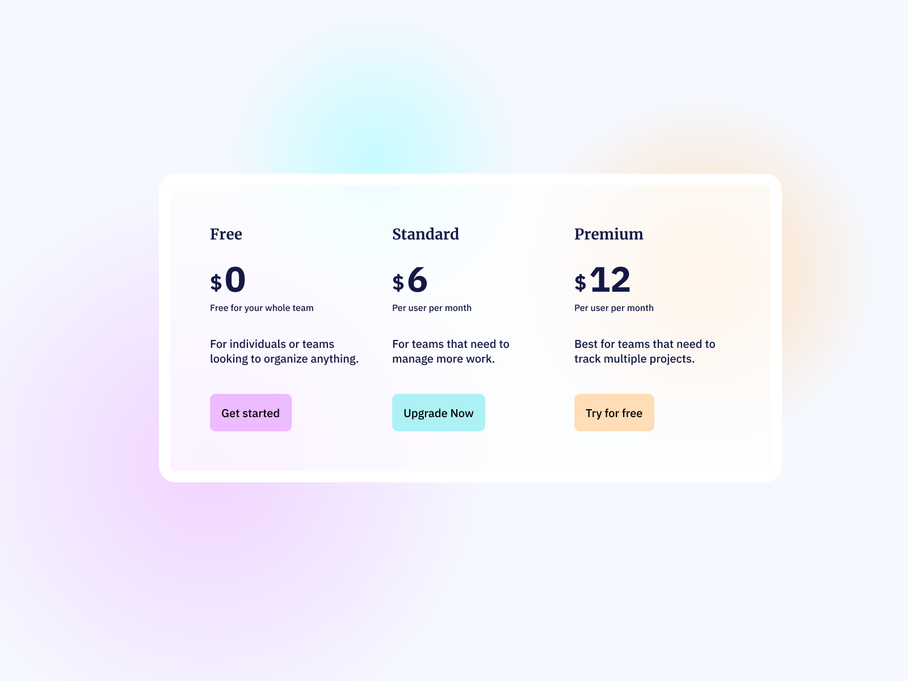

# Pricing Gradient Card



Nuestro desafío será codificar una **tarjeta gradiente de precios**, usando HTML y CSS, y lograr que se parezca lo más posible al diseño original.

## Recursos

Aquí encontrarás los recursos necesarios para completar el desafío.

```css
## Diseño
- Móvil: 375px
- Escritorio: 1200px


## Colores
- Body: #F5F8FF
- Ellipse 1: radial gradient (#FFDDB6 100%, #FFDDB6 0%)
- Ellipse 2: radial gradient (#EDBBFF 100%, #EDBBFF 0%)
- Ellipse 3: radial gradient (#C6FCFF 100%, #C6FCFF 0%)
- Card: #FFFFFF
- Button 1: #EDBBFF
- Button 2: #AEF1F5
- Button 3: #FFDDB6
- Paragraph: #141843


## Tipografía
### Body
- Font size: 16px

### Fonts
- Family (title): [Merriweather](https://fonts.google.com/specimen/Merriweather)
- Family (paragraph): [IBM+Plex+Sans](https://fonts.google.com/specimen/IBM+Plex+Sans)
```

## Ideas

Eres libre de utilizar las tecnologías que quieras. Lo importante es practicar y completar un proyecto todos los días:

- [Git](https://git-scm.com/)
- [CSS](https://www.w3schools.com/css/default.asp)
- [HTML](https://www.w3schools.com/html/default.asp)
- [Bootstrap](https://getbootstrap.com/)

## Comunidad

Únete a cientos de miembros que están mejorando sus habilidades de codificación y hablando sobre el desafío **100 days of projects**.

<a href="https://chat.whatsapp.com/LDaK0dksr8f7FbsTWSf0ww" class="btn">
  Quiero unirme
</a>


## Referencias

- Diseño tomado de: [UI Design Daily](https://www.uidesigndaily.com/posts/figma-pricing-card-day-1454)

---

> 🏷️"_La mejor manera de aprender a programar es practicando todos los días."_  

---