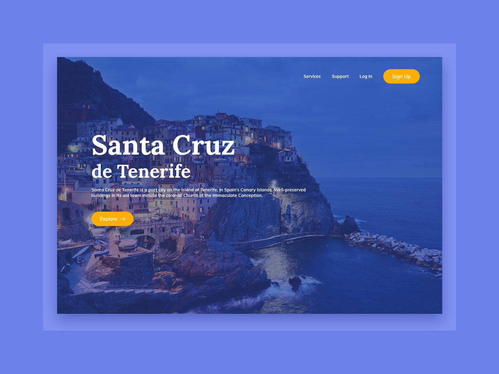

# Tourism Landing Page




Nuestro desafío será codificar una **landing page de turismo**, usando HTML y CSS, y lograr que se parezca lo más posible al diseño original.


## Recursos

Aquí encontrarás los recursos necesarios para completar el desafío.

```css
## Diseño
- Móvil: 375px
- Escritorio: 1200px


## Colores
- Body: #6C81E9
- Card border: #92A4FC
- Card: #344597
- Button: #FDAF01
- Paragraph: #FFFFFF


## Tipografía
### Body
- Font size: 16px

### Font
- Family: [SFProText](https://fonts.google.com/specimen/SFProText)
```


## Ideas

Eres libre de utilizar las tecnologías que quieras. Lo importante es practicar y completar un proyecto todos los días:

- [Git](https://git-scm.com/)
- [CSS](https://www.w3schools.com/css/default.asp)
- [HTML](https://www.w3schools.com/html/default.asp)
- [Bootstrap](https://getbootstrap.com/)


## Comunidad

Únete a cientos de miembros que están mejorando sus habilidades de codificación y hablando sobre el desafío **100 days of projects**.

<a href="https://chat.whatsapp.com/LDaK0dksr8f7FbsTWSf0ww" class="btn">
  Quiero unirme
</a>


## Referencias

- Diseño tomado de: [UI Design Daily](https://frontend-club.hashnode.dev/tourism-landing-page)

---

> 🏷️"_La mejor manera de aprender a programar es practicando todos los días."_  

---