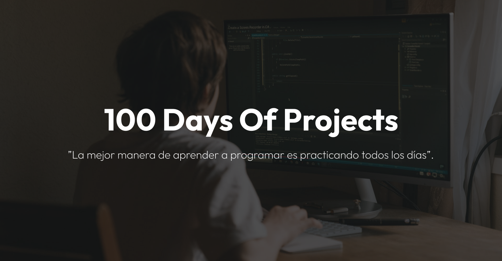

**Felicitaciones** por aceptar el desafío de codificación **100daysofprojects**. Hoy has tomado la decisión de mejorar tus habilidades de codifación frontend (HTML, CSS, JS & Git) construyendo proyectos reales durante los próximos 100 días.

Al completar los 100 proyectos, recibirás el **Kit #100daysofprojects** en cualquier parte del mundo.

## Recomendaciones

Eres libre de utilizar cualquier herramienta/tecnología y flujo de trabajo con el que te sientas más cómodo. A continuación, te sugerimos algunos consejos:

1. Crea un repositorio en [GitHub](https://github.com/) con el nombre del proyecto (ejemplo: 01-profile-card).
2. Clona el repositorio en tu pc local
3. Analiza los diseños antes de codificar
4. Despliega tu proyecto en un hosting gratuito como [GitHub Pages](https://pages.github.com/), [Netlify](https://www.netlify.com/) o [Vercel](https://vercel.com/)
5. Comparte tu proyecto con la [comunidad](https://chat.whatsapp.com/LDaK0dksr8f7FbsTWSf0ww)

## Comunidad

Únete a cientos de miembros que ya están mejorando sus habilidades de codificación y hablando sobre el desafío **100daysofprojects**.

- [WhatsApp](https://chat.whatsapp.com/LDaK0dksr8f7FbsTWSf0ww)
- [Facebook](https://www.facebook.com/frontendclubfb)
- [100daysofprojects](https://www.facebook.com/groups/100daysofprojects)

## Nosotros

**Frontend Club** te ayuda a mejorar tus habilidades de codificación en HTML, CSS y JavaScript, mediante la construcción de proyectos reales todos los días.

Un cafecito☕ para seguir creando nuevos desafíos de codificación (#10realprojects). Mira quién está detrás de Frontend Club.

---

> _La mejor manera de aprender a programar es practicando todos los días._